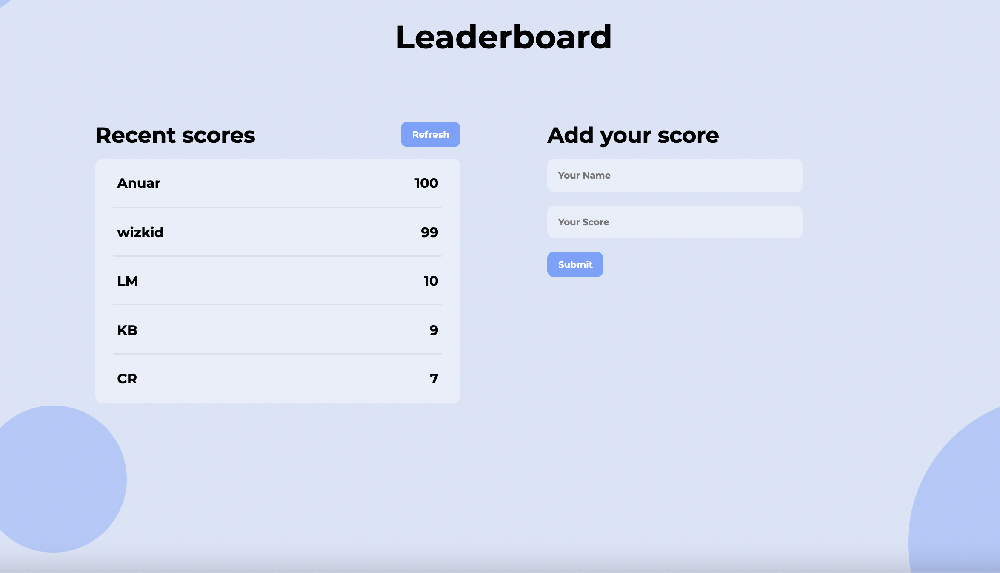

# Leaderboard

> The leaderboard website displays scores submitted by different players. It also allows you to submit your score. All data is preserved thanks to the external Leaderboard API service.

## Built With

- JavaScript
- React
- CSS

## Installation

Go to your terminal, navigate to your working directory and run

`git clone https://github.com/anuarshaidenov/leaderboard-react.git`

After that navigate to the newly created folder

`cd leaderboard`

You now have access to the files.
To install necessary dependencies run

`npm install`

Start a local server running the command

`npm start`

You should now have the project running locally on a dev server.

